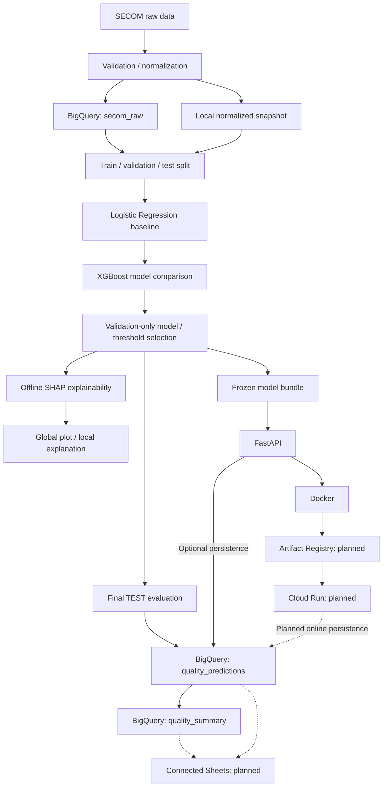
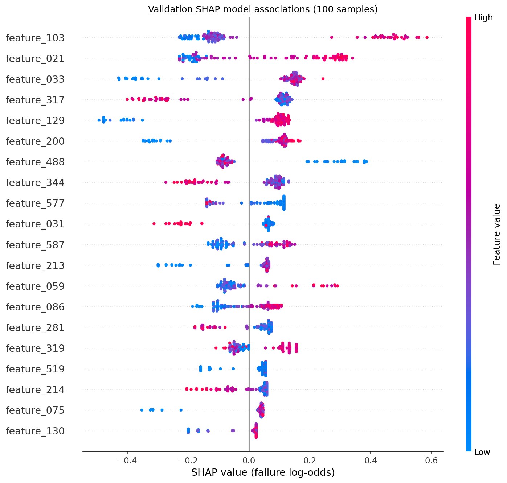

# Manufacturing AI Quality Analytics

An end-to-end manufacturing quality failure screening PoC using the [UCI SECOM dataset](https://archive.ics.uci.edu/dataset/179/secom) (CC BY 4.0). The project connects validated semiconductor process measurements, model comparison, offline explanations, BigQuery reporting, and containerized inference. The verified dataset contains 1,567 samples, 590 anonymized features, and 104 failures. Failure is the positive class (`FAIL=1`, `PASS=0`). Verified implementation reaches local Docker inference and BigQuery batch reporting; cloud deployment and Connected Sheets remain planned.

## Architecture

Solid arrows show implemented paths; dashed arrows show planned integrations. Model development was verified using the local normalized snapshot; the code also supports read-only BigQuery training input. SHAP is a separate offline validation analysis, completed before final TEST scoring.



## Key results

Final held-out TEST results from [the evaluation report](reports/final_test_evaluation.json), using the frozen XGBoost candidate 1:

| Metric | Result |
| --- | ---: |
| Test samples | 314 |
| Actual FAIL | 21 |
| **PR-AUC (primary metric)** | **0.277825** |
| ROC-AUC | 0.768243 |
| Recall | 0.952381 |
| Precision | 0.076336 |
| F1 | 0.141343 |
| Detected FAIL | 20 of 21 |
| Frozen threshold | 0.08485201001167297 |

The operating point prioritizes recall for failure screening: 262 samples were flagged, including **242 false positives**, while one failure was missed. It supports review prioritization and is not intended as an automatic pass/fail production decision system. PR-AUC uses `precision_recall_curve` followed by trapezoidal `auc(recall, precision)`; it is not average precision.

## Model development

- Persisted stratified split with seed 42: 940 training, 313 validation, and 314 TEST samples.
- Train-only preprocessing drops features with more than 50% missingness, median-imputes, and removes constants, retaining 450 features. Logistic Regression additionally standardizes inputs and uses balanced class weights.
- Two CPU XGBoost candidates use depth/tree counts of 2/120 and 3/180, with class weights calculated from training labels only. They reuse fitted preprocessing without scaling.
- Validation PR-AUC selects candidate 1: 0.173602 versus 0.108350 for Logistic Regression and 0.160332 for candidate 2. Validation-only threshold selection maximizes precision subject to recall at least 0.80.
- Model, preprocessing, and threshold were frozen without a train-plus-validation refit. TEST remained untouched until the one-time final evaluation; guarded cached predictions support persistence retries without rescoring.

## Explainability

SHAP TreeExplainer analyzes 100 fixed validation samples against a 64-sample training background. Global importance and a local example retain original feature IDs; contributions use failure log-odds, with additivity and score reconstruction checked. **SHAP indicates model associations, not physical root causes or causality.**



## Data platform

BigQuery resources use the `secom_quality` dataset:

| Resource | Purpose / evidence |
| --- | --- |
| `secom_raw` | Normalized raw measurements, stable sample IDs, source timestamps, and failure labels; ingestion uses explicit schema and source checksum validation. |
| `quality_predictions` | 314 labeled TEST predictions were written and individually verified, with run/model/dataset identity, score, threshold, and actual failure. Optional API rows use null labels and split. |
| `quality_summary` | Verified logical view pinned to one explicit TEST batch run; exposes sample count, observed failures, flagged count, mean score, recall, and precision. Excludes API traffic. |

Observed failure fields use actual labels. Predicted risk scores and flagged counts are not measured manufacturing yield. Connected Sheets is the planned business-user interface to these reporting resources.

## Connected Sheets dashboard

The planned dashboard would let business users review KPIs and prioritize high-risk samples without writing SQL. Connected Sheets connection, refresh, and dashboard verification are not recorded in this repository. No dashboard screenshot is available.

## Inference API

The frozen model loads once at startup; requests perform inference using saved preprocessing and threshold.

| Verified endpoint | Behavior |
| --- | --- |
| `GET /health` | Returns status and model version after loading; performs no BigQuery query. |
| `GET /model-info` | Returns 590 ordered raw feature names, positive-class meaning, model version, and frozen threshold. |
| `POST /predict` | Accepts a nonempty `sample_id` and exactly 590 finite numbers or nulls; returns score, classification, threshold, IDs, and persistence status. |

Features follow `feature_000` through `feature_589`; nulls use saved training medians. Invalid input returns `422`. Local persistence defaults to disabled. Optional online BigQuery persistence is covered by mocked tests; warehouse failure returns `503`.

## Deployment

Target path: **FastAPI → Docker → Artifact Registry → Cloud Run**. FastAPI and local Docker are verified; Artifact Registry publication and Cloud Run deployment have no verification evidence in the inspected repository.

Local FastAPI and the Docker container returned matching results for the same synthetic all-null 590-feature request: `failure_score=0.46548160910606384`, `predicted_failure=true`, frozen threshold `0.08485201001167297`, and `stored=false`. Prediction UUIDs vary per call. Cloud Run prediction parity remains unverified.

The image runs as UID/GID `10001`, loads the packaged frozen bundle, and listens on port 8080. Final local image size: **2,559,336,032 bytes** (about 2.56 GB).

Run from the repository root with Docker Desktop's Linux engine:

```powershell
docker build --tag quality-api:local .
docker run --detach --name quality-api-local --publish 127.0.0.1:8080:8080 --env PERSIST_PREDICTIONS=false quality-api:local
Invoke-RestMethod -Uri "http://127.0.0.1:8080/health"
$body = @{ sample_id = "docker-demo-001"; features = [object[]]::new(590) } | ConvertTo-Json -Depth 3 -Compress
Invoke-RestMethod -Method Post -Uri "http://127.0.0.1:8080/predict" -ContentType "application/json" -Body $body
```

Stop and remove this demo container with `docker stop quality-api-local` and `docker rm quality-api-local`. See [API instructions](docs/API.md) for host execution and environment configuration; `.env.example` is not loaded automatically.

## Testing

- **70 Python tests passed during final local Docker verification**, with zero failures or errors.
- Frozen model SHA-256 matched on host and in container: `66e00f2be70812c15c3d94dba81ce62116f8df3089d548dd4f5fa01a64559d8c`.
- Docker reported `healthy`; health, model-info, and prediction HTTP checks returned `200`, with exact host/container prediction and model-info parity.
- BigQuery batch rows and summary values were verified against cached TEST predictions. Cloud Run health and prediction endpoints remain unverified.

```powershell
& .\.venv\Scripts\python.exe -m pip install -r requirements.txt
& .\.venv\Scripts\python.exe -m unittest discover -s tests -p "test_*.py" -v
```

The full suite requires existing local raw/normalized data and development artifacts used by its integration checks. Inference uses the committed selected bundle; other generated artifacts and datasets are ignored. Tests do not repeat the real final TEST evaluation.

## Repository structure

| Directory | Contents |
| --- | --- |
| `src/quality_analytics/` | Validation, ingestion, splitting, preprocessing, training, comparison, SHAP, batch persistence, and API modules. |
| `tests/` | Standard-library `unittest` checks, including mocked cloud boundaries. |
| `sql/` | Raw/prediction table schemas and the explicit-run reporting view. |
| `docs/` | Stage-specific methodology, commands, results, and verification records. |
| `reports/` | Reviewed JSON results and the SHAP summary image. |
| `artifacts/` | Frozen inference bundle; other local model, split, and cached evaluation outputs. |

## Tech stack

Implemented: Python 3.10, BigQuery, scikit-learn, XGBoost, SHAP, FastAPI, and Docker. Planned deployment/reporting: Google Artifact Registry, Cloud Run, and Connected Sheets. Python dependencies are recorded in [requirements.txt](requirements.txt).

## Limitations

- SECOM features are anonymized; physical sensor or process meanings are unavailable.
- Public benchmark data is not equivalent to a live fab environment. Random splitting and only 21 TEST failures limit generalization evidence.
- The high-recall threshold produces many false positives; scores are uncalibrated model outputs.
- SHAP cannot establish physical causality or prescribe process adjustments.
- This is a portfolio PoC, not a production factory control system; factory integration is outside the implemented scope.

## Detailed documentation

- [MVP plan and intended architecture](docs/PLAN.md)
- [Logistic Regression baseline and preprocessing](docs/BASELINE.md)
- [XGBoost comparison and validation-only selection](docs/COMPARISON.md)
- [Offline SHAP methodology and safeguards](docs/SHAP.md)
- [Final TEST evaluation and verified BigQuery batch](docs/FINAL_TEST.md)
- [FastAPI contract and local execution](docs/API.md)
- [Docker build, smoke checks, parity comparison, and cleanup](docs/DOCKER.md) — its historical engine-blocked status predates the successful final local verification summarized above.
